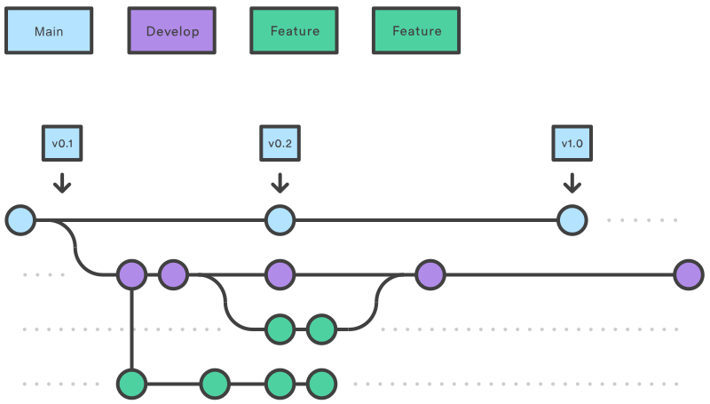

## 📑 Förslag på README-struktur

### 1. **Titel och kort beskrivning**

> # AI Movie Recommender
>
> Ett Python-projekt som använder AI för att tolka vad du gillar för filmer och rekommenderar titlar från OMDb API.

---

### 2. **Funktioner**

Lista vad projektet kan göra.

* Användaren skriver vad för filmer de gillar (formulär + fritext).
* AI tolkar texten och hittar relevanta nyckelord.
* OMDb API hämtar filmer baserat på sökningen.
* Resultaten visas i ett GUI/webbapp med titel, poster och betyg.
* Varje sökning sparas i en lokal databas. I Cli-versionen kan vi se de 10 senaste sökningarna

---

### 3. **Installation**

Hur man kör projektet.
```bash
# Klona projektet
git clone git@github.com:Zaitex89/Grupp2.git
cd Grupp2

# Installera beroenden
pip install -r requirements.txt

# Kör appen
py app.py (Flask)

alternativt:

py main.py (Cli) 
```

---

### 4. **Tekniker & API:er**

Lista vilka ni använder.

* **Programspråk:** Python 3.x
* **Bibliotek:** requests, flask, unittest.mock, sqlite3
* **AI:** OpenAI API (GPT-4) / Hugging Face Transformers
* **Filmdata:** OMDb API

---

### 5. **Användning**

Visa hur programmet funkar med exempel.
AI ger rekommendation med inspiration från vad som matas in i formuläret (oavsett Flask eller CLI).
Saknas godkänd API-nyckel ges ej en rekommendation från AI. 
Då hämtas istället 5 filmer direkt från OMDb, direkt baserat på vilka ord som angetts i formuläret.

* Starta appen
* Skriv in information som:
    Favorite movie or genre: [filmtitel]
    How are you feeling?: [humör/sinnesstämning]
    Tell us more (optional): [fritext, vilken information som helst]

Om Flask:
* Appen visar en lista på filmer
* Filmtitlarna har tillhörande:
    poster
    info från OMDb
    IMDb rating
    AI kommentar

Om CLI:
* Terminalen visar en lista på filmer
* Filmtitlarna har tillhörande:
    info från OMDb
    IMDb rating
    AI kommentar
* Databas sparar vilka sökningar som har gjorts med tillhörande rekommenderade filmer.

---

### 6. **Struktur (mapp & filer)**




```

ai_movie_recommender/
│
├── ai/
│   └── gpt_interpreter.py         # Tolkar användarens input med GPT och genererar AI-kommentarer
├── omdb/
│   └── omdb_client.py             # Hämtar filmdata från OMDb API
├── recommender/
│   └── movie_recommender.py       # Samordnar AI-tolkning, OMDb-sökning och filmrankning
├── templates/
│   ├── index.html                 # Startsida med formulär för användarinput
│   └── results.html               # Visar rekommenderade filmer med AI-kommentarer
├── tests/
│   └── test_omdb_client.py        # Enhetstester för OMDb-klienten
├── app.py                         # Flask-applikationens entrypoint
├── featuresseached.py             # Skapar & hanterar databas med info om tidigare filmsökningar
├── main.py                        # CLI-version av programmet
│
├── requirements.txt               # Lista över beroenden (Flask, requests, etc.)
└── README.md                      # Projektbeskrivning, installation och användning

```


---

### 7. **Team**

Lista gruppmedlemmar + vad de bidrog med.

* Alex: API-integration
* Allan: AI-modul
* Patrik: GUI/visualisering
* André: Extra features, databas

* Alex = Zaitex89
* Patrik = KFCGitten
* Andre = tei312    
* Allan = AllanAkkus

### 8. **Vem har gjort vad**

Alex 

* hela omdb folder
* tests folder -> test_omdb_client.py
* .env
* main.py
* README.md strukturen

Patrik
* README.md, information, projekt-strukturkarta
* app.py
* bug-fix
* templates -> index.html, results.html

Allan
* gpt_interpreter.py
* recommender -> movie_recommender.py
* integration av AI

André
* Databas-hantering
* featuressearched.py

```